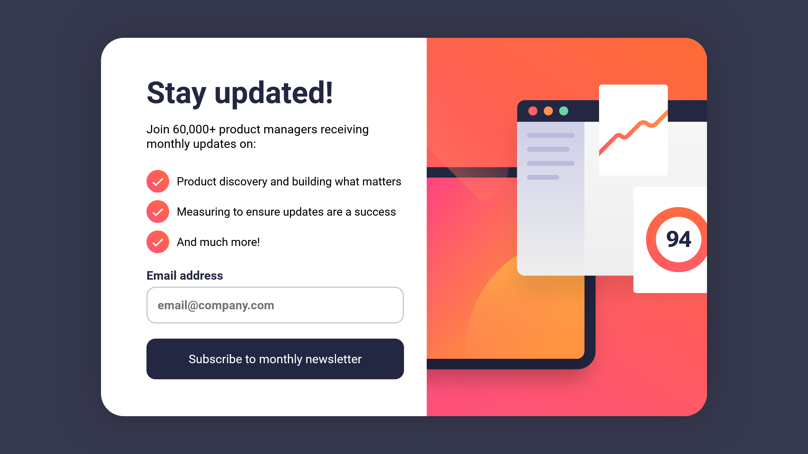

# Frontend Mentor - Newsletter sign-up form with success message solution

This is a solution to the [Newsletter sign-up form with success message challenge on Frontend Mentor](https://www.frontendmentor.io/challenges/newsletter-signup-form-with-success-message-3FC1AZbNrv). Frontend Mentor challenges help you improve your coding skills by building realistic projects.

## Table of contents

- [Overview](#overview)
  - [The challenge](#the-challenge)
  - [Screenshot](#screenshot)
  - [Links](#links)
- [My process](#my-process)
  - [Built with](#built-with)
- [Author](#author)
- [Acknowledgments](#acknowledgments)

## Overview

### The challenge

Users should be able to:

- Add their email and submit the form
- See a success message with their email after successfully submitting the form
- See form validation messages if:
  - The field is left empty
  - The email address is not formatted correctly
- View the optimal layout for the interface depending on their device's screen size
- See hover and focus states for all interactive elements on the page

### Screenshot

### Links

- Solution URL: [Link](https://www.frontendmentor.io/solutions/newsletter-signup-form-with-success-message-NxsCdPCS7K)
- Live Site URL: [Link](https://amir-ranjbr.github.io/FrontEndMentorSolution/)

### Built with

- HTML5
- CSS
- JavaScript

## Author

- Frontend Mentor - [@Amir-Ranjbr](https://www.frontendmentor.io/profile/Amir-Ranjbr)
- YouTube - [Weird-Code](https://www.youtube.com/@Weird-Code)
- Github - [Amir-Ranjbr](https://github.com/Amir-Ranjbr)

## Acknowledgments

In order to complete this challenge we need to create states in JavaScript.
